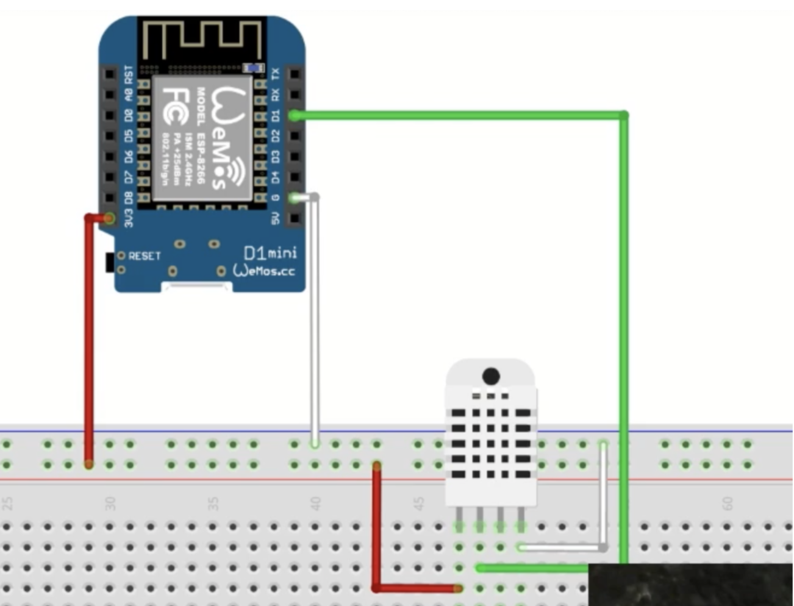
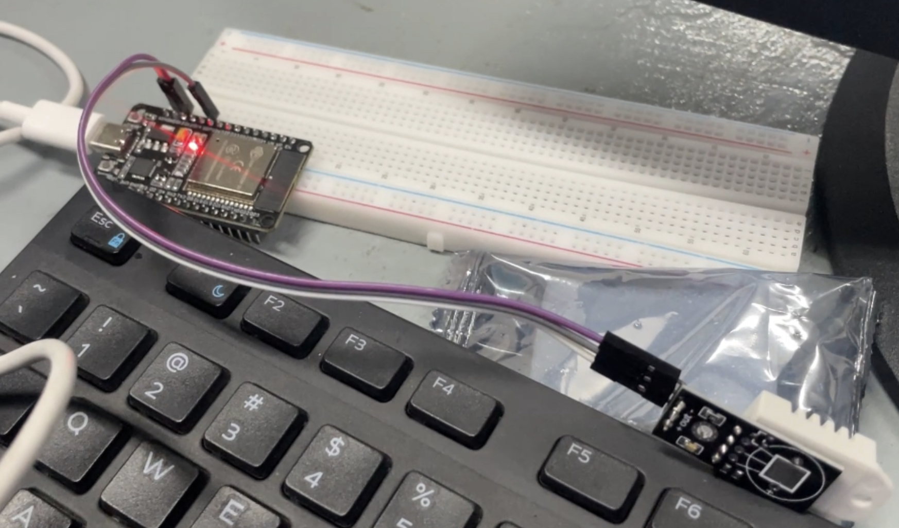
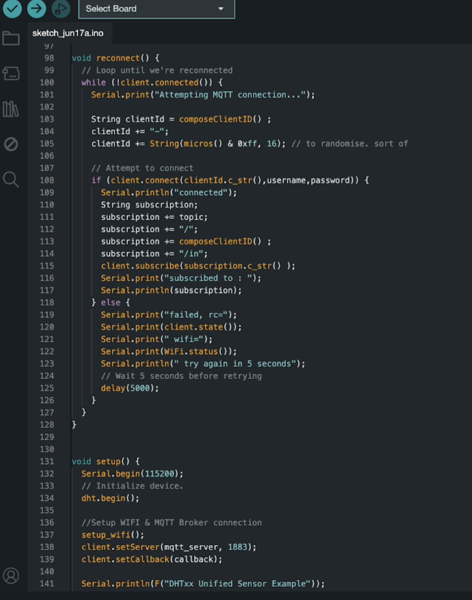
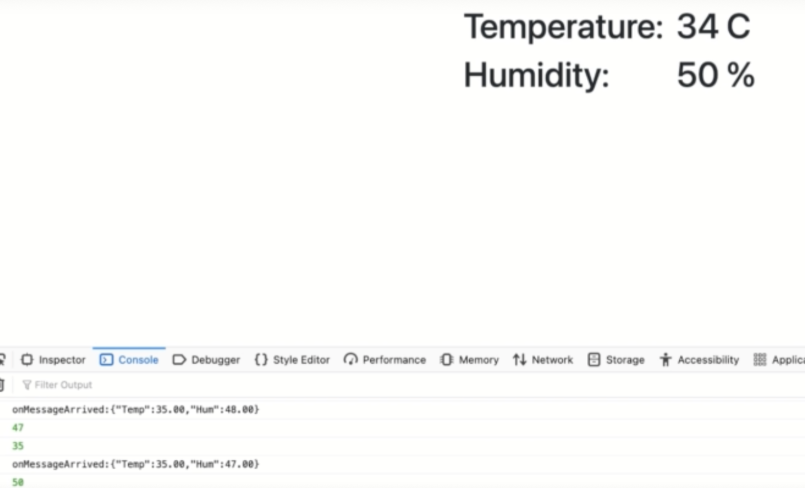
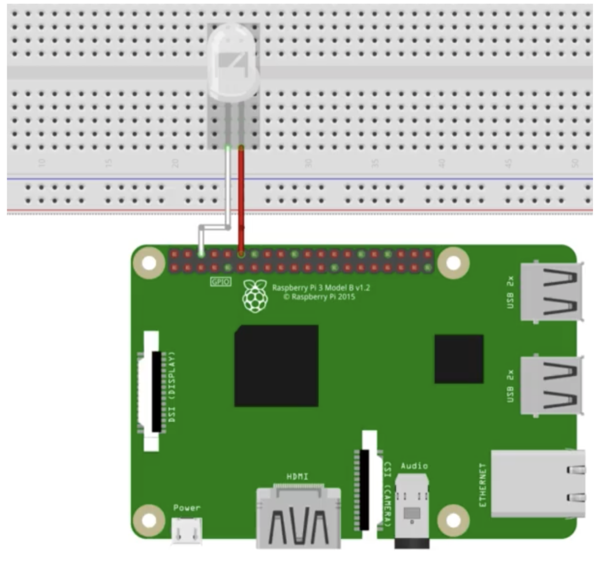
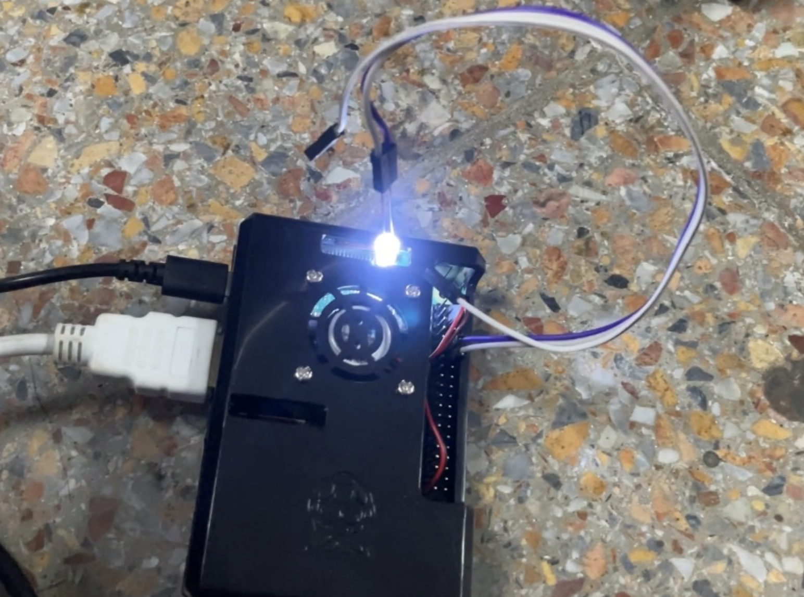
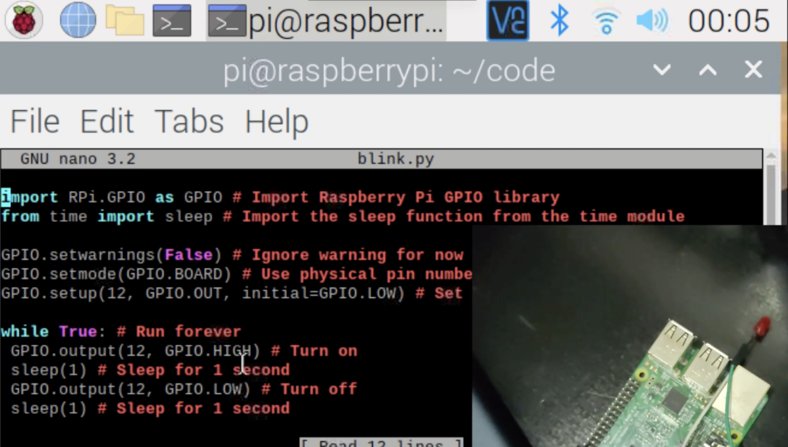
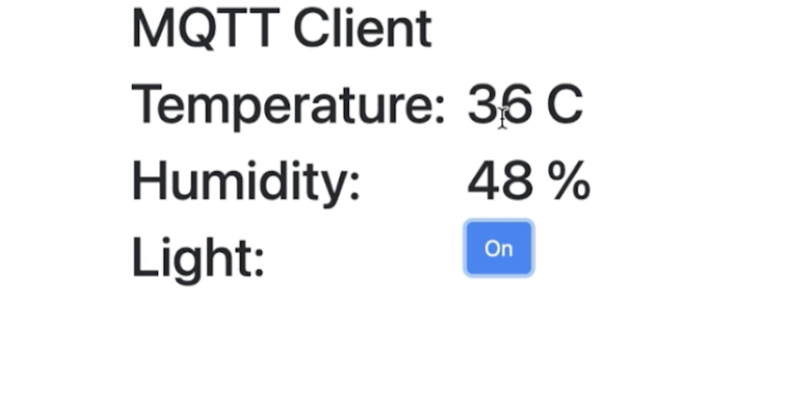

# Final Project Integrasi Sistem B
### “Implementasi Integrasi Antar ESP32 dan Raspberry pi Menggunakan MQTT Mosquitto”


## Kelompok 4 ( Integrasi Sistem B )
| Nama | NRP | 
|----------|----------|
| Mutiara Nurhaliza | 5027221010 | 
| Rehana Putri Salsabilla | 5027221015 | 

Link video Youtube Demonstrasi Final Project : ```https://youtu.be/GolJ3J082KA```

Link Github Source Code : ```https://github.com/rehanasalsabilla/FP_Integrasi_Sistem_5027221010_5027221015```

# Daftar Isi
## Project 1
1. [Setup Hardware](#setup-hardware)
2. [Setup Program dan Arduino IDE](#setup-program-dan-arduino-ide)
3. [Testing Koneksi dengan MQTT.run](#testing-koneksi-dengan-mqttrun)
4. [Setup Web App untuk Display Data](#setup-web-app-untuk-display-data)

## Project 2
1. [Setup Hardware](#setup-hardware)
2. [Setup Program LED Blink](#setup-program-led-blink)
3. [Setup Mosquitto](#setup-mosquitto)
4. [Pengaturan Username dan Password](#pengaturan-username-dan-password)
5. [Koneksi ke Broker MQTT](#koneksi-ke-broker-mqtt)
6. [Setup Web App untuk Mengontrol LED](#setup-web-app-untuk-mengontrol-led)

---

## Project 1
Alat yang diperlukan :
| Nama Alat   | Fungsi                                                                                      |
|-------------|---------------------------------------------------------------------------------------------|
| ESP32       | Berfungsi sebagai mikrokontroler utama yang mengelola pengambilan data dari sensor dan mengirimkannya ke jaringan atau perangkat lain. |
| DHT22       | Sensor yang mengukur suhu dan kelembaban lingkungan secara akurat dan mengirimkan data ini ke mikrokontroler. |
| Bread Board | Alat untuk membuat rangkaian elektronik sementara tanpa perlu menyolder, memudahkan penghubungan komponen seperti sensor dan LED. |
| Kabel Jumper| Kabel penghubung yang digunakan untuk membuat koneksi antara komponen-komponen pada breadboard atau menghubungkan komponen ke mikrokontroler. |

### Setup Hardware
Hal pertama yang harus dilakukan adalah melakukan setup hardware. Sebelumnya buat gambaran rangkaiannya secara digital agar memudahkan pemasangan hardware

Siapkan alat alat yang telah disebutkan diatas seperti esp32, dht22, bread board, kabel jumper, gunakan kabel jumper untuk menghubungkan dht22 dengan esp32, dengan mapping kabel seperti dibawah 
| Pin DHT22 | Koneksi ke ESP32 |
|-----------|------------------|
| GND (-)   | GND/Ground       |
| Data      | D15              |
| VCC (+)   | 3.3v             |

Berikut hasil pemasangan hardware sesuai dengan mapping kabel diatas


### Setup Program dan Arduino IDE
- ```a. Instalasi Library:``` Pertama, pastikan untuk menginstal library yang dibutuhkan, seperti library untuk sensor DHT22 dan library PubSubClient. Library PubSubClient memungkinkan komunikasi dengan broker MQTT untuk melakukan publish dan subscribe pesan.
- ```b. Konfigurasi Program:``` Selanjutnya, atur program yang akan diunggah ke ESP32. Sesuaikan beberapa konfigurasi berdasarkan kebutuhan yang termasuk informasi seperti:
  - Koneksi WiFi: Sesuaikan dengan SSID dan password WiFi yang akan digunakan.
  - Server/IP Broker MQTT: Masukkan alamat server atau IP broker MQTT yang akan digunakan.
  - Topic: Tentukan topic MQTT untuk publish dan subscribe pesan.
  - Otorisasi: Sertakan username dan password jika broker MQTT Anda memerlukan autentikasi.
  - Pin yang Digunakan: Sesuaikan dengan pin pada NodeMCU yang terhubung ke sensor DHT22.
- ```c. Unggah Program:``` Setelah melakukan konfigurasi, unggah program ke ESP32.


### Testing Koneksi dengan MQTT.run
#### Memantau output dari ESP 32 melalui website mqtt.run. Berikut langkah langkah nya:
- ```Konfigurasi Website mqtt.run:``` 
  - Buka website mqtt.run dan masukkan detail konfigurasi yang sesuai dengan program yang telah diunggah ke NodeMCU ESP8266. Ini termasuk alamat broker MQTT, topic yang digunakan, serta informasi otorisasi seperti username dan password.
- ```Memonitor Output:``` 
  - Setelah memasukkan konfigurasi, akan terlihat output dari sensor DHT22 yang dikirim melalui MQTT. Data ini akan ditampilkan di halaman website mqtt.run.

### Setup Web App untuk Display Data
- ```Sumber Referensi:```
  - Menggunakan Udemy sebagai referensi dalam membuat dashboard HTML.
- ```Penyesuaian Konfigurasi:```
  - IP Broker: Memasukkan alamat IP broker MQTT yang digunakan.
  - Port: Memastikan port yang digunakan sesuai dengan konfigurasi broker MQTT.
  - Topik (Topic): Menetapkan topik yang akan dipantau untuk mendapatkan data dari sensor.
  - Username dan Password: Menambahkan informasi autentikasi dengan broker MQTT 
- ```Menampilkan Data di Dashboard:```
  - Setelah melakukan penyesuaian, buka file HTML di browser. Jika konfigurasi sudah benar, dashboard HTML akan menampilkan data dari sensor DHT22 secara real-time. Hasilnya akan mirip dengan gambar di bawah ini, yang menunjukkan informasi yang diperoleh dari sensor.


---

## Project 2 ( Integrasi Deteksi Suhu (Project 1) dengan lampu LED dan Raspberry pi )
Alat yang diperlukan:
| Nama Alat   | Fungsi                                                                                      |
|-------------|---------------------------------------------------------------------------------------------|
| ESP32       | Berfungsi sebagai mikrokontroler utama yang mengelola pengambilan data dari sensor dan mengirimkannya ke jaringan atau perangkat lain. |
| DHT22       | Sensor yang mengukur suhu dan kelembaban lingkungan secara akurat dan mengirimkan data ini ke mikrokontroler. |
| Bread Board | Alat untuk membuat rangkaian elektronik sementara tanpa perlu menyolder, memudahkan penghubungan komponen seperti sensor dan LED. |
| Kabel Jumper| Kabel penghubung yang digunakan untuk membuat koneksi antara komponen-komponen pada breadboard atau menghubungkan komponen ke mikrokontroler. |
| Raspberry Pi| Komputer kecil yang dapat diprogram untuk berbagai aplikasi, seperti menjalankan server, mengontrol perangkat elektronik, atau melakukan pemrosesan data dalam proyek IoT. |
| Lampu LED   | Komponen elektronik yang memancarkan cahaya ketika dialiri arus listrik, sering digunakan sebagai indikator status dalam berbagai aplikasi. |


### Setup Hardware
Hal pertama yang harus dilakukan adalah melakukan setup hardware. Sebelumnya buat gambaran rangkaiannya secara digital agar memudahkan pemasangan hardware

Siapkan alat alat yang telah disebutkan diatas seperti raspberry pi, LED, kabel jumper, gunakan kabel jumper untuk menghubungkan Raspberry pi dengan LED, dengan mapping kabel seperti di bawah 
| Pin Lampu LED | Koneksi ke Raspberry Pi |
|---------------|-------------------------|
| Katoda        | GND/Ground              |
| Anoda         | D1                      |

Berikut hasil pemasangan hardware sesuai dengan mapping kabel diatas:


### Setup Program LED Blink
- ```Penyiapan LED:```
  - Menghubungkan LED ke Raspberry pi menggunakan kabel jumper dan menggunakan pin GPIO yang sama dengan yang digunakan dalam udemy, yaitu pin GPIO D1.
- ```Validasi Pengaturan:```
  - Setelah pemasangan selesai, ketika suhu terdeteksi oleh sensor DHT22, program akan mengaktifkan atau mematikan LED sesuai dengan logika yang telah diatur. LED akan memberikan umpan balik visual bahwa sensor berfungsi dan mendeteksi suhu.


### Setup Mosquitto
- ```Instalasi Paho-MQTT:```
  - Pastikan library Paho-MQTT terinstal, yang diperlukan untuk mengelola komunikasi MQTT pip install paho-mqtt
- ```Menentukan Topik untuk Subscribe:```
  - Menetapkan topik yang akan di-subscribe oleh client di dalam fungsi on_connect. Kami menggunakan topik /labkcks/room/led.
```
def on_connect(client, userdata, flags, rc):
client.subscribe("/lab-kcks/room/led")
```

### Pengaturan Username dan Password
Gunakan fungsi client.username_pw_set untuk Mengatur username dan password pada fungsi client.username_pw_set. 
```
client.username_pw_set(username="admin",password="kcks1029")
```

### Koneksi ke Broker MQTT
Melakukan Konfigurasi koneksi broker, termasuk IP address, port, dan waktu looping dalam detik. Copy code
```
client.connect("152.42.194.14", 1883, 60)
```

### Setup Web App untuk Mengontrol LED
- Ambil source code webpage dari resource course project 2 dan lakukan penyesuaian pada pengaturan MQTT. Pastikan bahwa setting MQTT pada halaman web sesuai dengan pengaturan yang telah digunakan dalam file mqtt_sub.py. Ini termasuk memastikan IP broker, port, dan topik sudah sesuai.
```
Server="152.42.194.14";
Port="9000";
Topic="/lab-kcks/room/temperature";
MQTTUserName="admin";
MQTTPassword="kcks1029";
```
- Menambahkan button pada web app
```
$("#btnLed").click(function(){
if($("#btnLed").text()=="On"){
console.log("On");
$("#btnLed").text("Off");
TurnOnOffLed("On");
}else{
console.log("Off");
$("#btnLed").text("On");
TurnOnOffLed("Off");
}
});
```

- Menambahkan fungsi agar button yang telah dibuat sebelumnya bisa terhubung dengan MQTT
```
function TurnOnOffLed(Signal){
if(Connected){
if(Signal=="On"){
message = new Paho.MQTT.Message("On");
}else{
message = new Paho.MQTT.Message("Off");
}
message.destinationName = LedTopic;
client.send(message);
}
}
```

- Setelah menambahkan button pada html maka tampilan web app akan berubah menjadi seperti ini:


## ```Komunikasi M2M Antara ESP32 dan Raspberry pi```
- Ketika suhu yang diambil dari sensor DHT 22 pada ESP32 berada diatas 30 derajat


- Maka lampu LED pada Raspberry pi akan menyala

